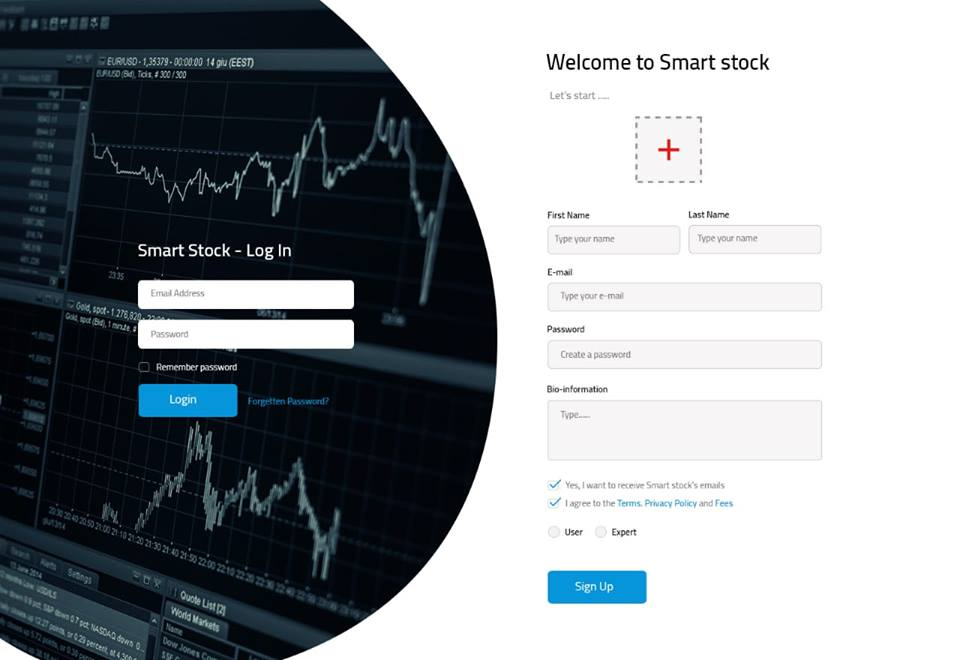
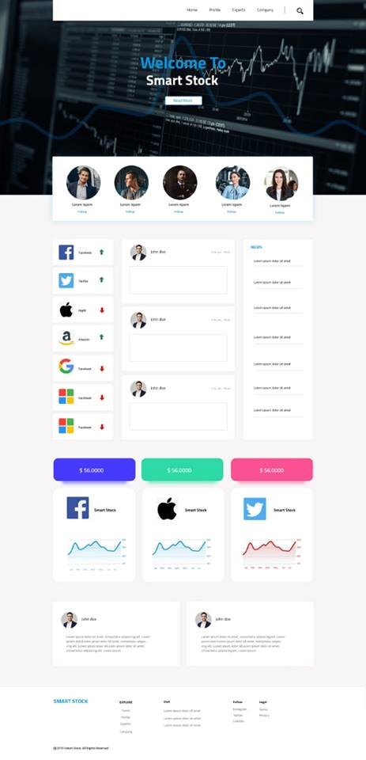
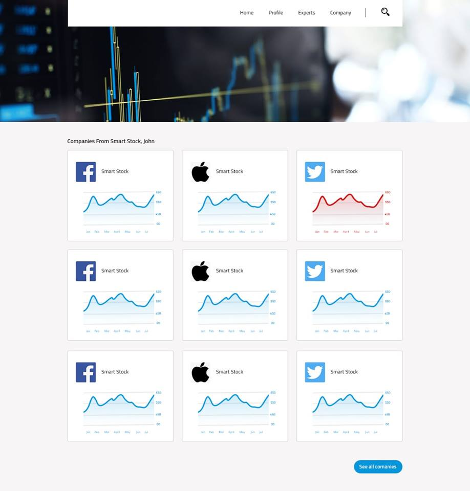
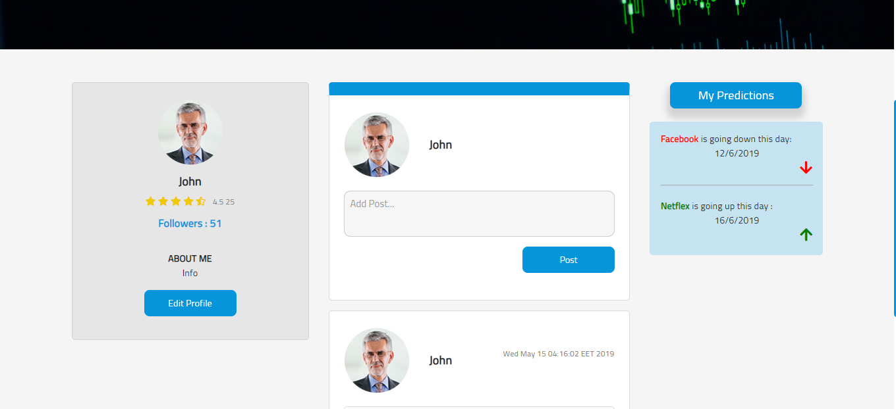
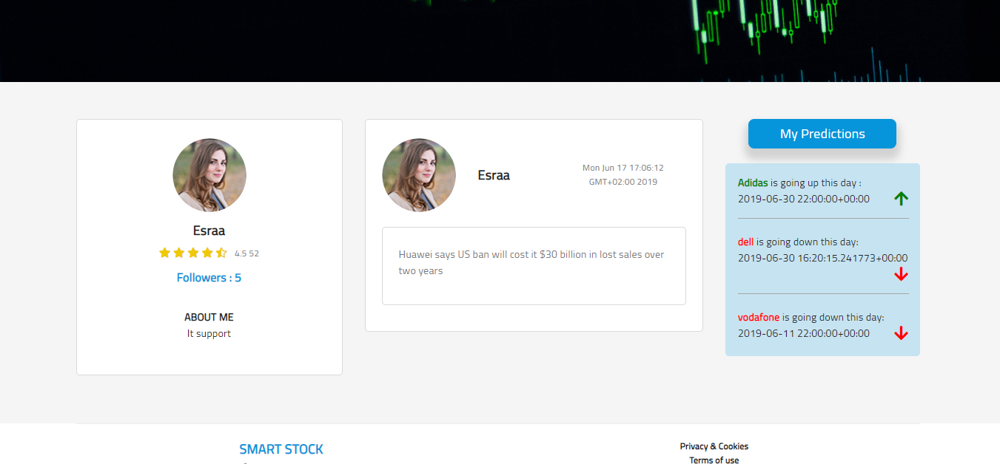
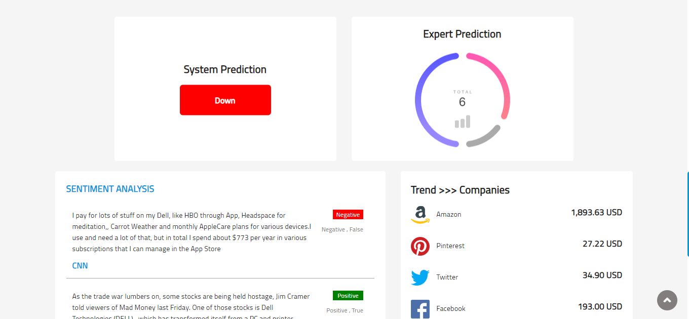

# Web-Interface-Using-Flask-and-firestore-for-smart-stock-project
build web interface for smart stock project using flask python framework and no sql and realtime database called cloudstore next generation of firebase.

1 - Front end 
We designed a very basic frontend to help users to interact with our website easily .
To build the frontend , we use HTML , CSS , JS , Bootstrap 

2 - Backend 
We designed our interface using flask python framework and restful api.

3 - centerlized database 
using a realtime nosql cross database called cloudstore next generation of firestor database

4 - we have two views in this interface cause we have two users first normarl user and second expert each of them can follow comapanies and experts and the notifications about them and can write and read posts.

# some screens

